# Energostat - Web Application providing data on energy consumption in different countries

<div align="center">
  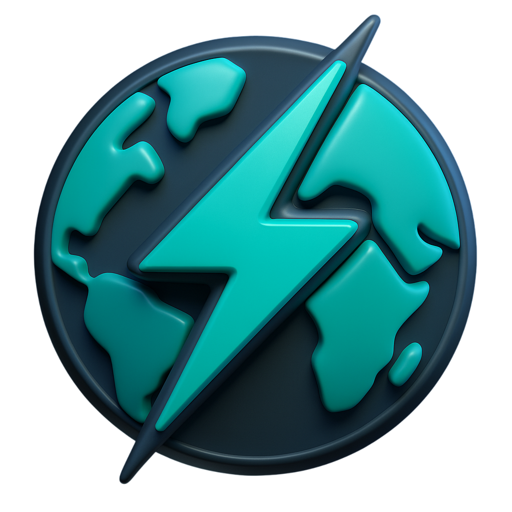
</div>

## Table of Contents
- 🚀 [Project Overview](#project-overview)
- ✨ [Features](#features)
- 💻 [Technologies](#technologies)
- 📋 [Requirements](#requirements)
- 🛠️ [Setup Instructions](#setup-instructions)
- 📸 [Screenshots](#screenshots)

## Project Overview
Energostat is a web application built with React and Express, working with a MySQL database. Its main purpose is to present the relationship between a country's population and its energy consumption. The application integrates with two external APIs and combines the data obtained from them.
> [!NOTE]  
> Energostat web application is only available in English language version!

## Features

**Unauthenticated User**
- 📝 Account registration
- 🔑 Login

**Logged-in User**
- 🌍 Ability to select statistics from over 190 countries
- 📅 Option to choose a specific range of years
- 📈 Clear presentation of data in charts or tables
- ⏳ Search history for quick access to recently viewed data
- 📤 Export loaded data (JSON, XML)
- 📥 Import and preview of data (JSON, XML)
- 💾 Saving API-fetched data to the database and the ability to load it later
- 📱 Full responsiveness

## Technologies
The application is fully containerized using Docker Compose.

**Backend**
- Express
- Node.js
- MySQL
- JWT
- ORM
- 2 levels of database access isolation
- bcryptjs
- Ember API (Energy data)
- World Bank API (Population data)

**Frontend**
- React
- Axios
- chart.js
- gsap

## Requirements
Software versions used for development:
- React 19.1.0
- Express 5.1.0
- Node.js 24.14.0
- npm 10.9.2
- MySQL 10.4.32
> [!WARNING]  
> Compatibility with earlier versions has not been tested.

## Setup Instructions
To run this project, you must have Docker installed on your system.
> [!IMPORTANT]  
> *Download guide: [Installing Docker](https://docs.docker.com/get-started/get-docker/)*

1. Download and extract the Energostat folder.
2. Start Docker Engine on your computer.
3. Navigate to the `docker` folder in your terminal.
4. Use command:
```
docker-compose up
```
5. Access the application at [http://localhost:3000](http://localhost:3000).

## Screenshots
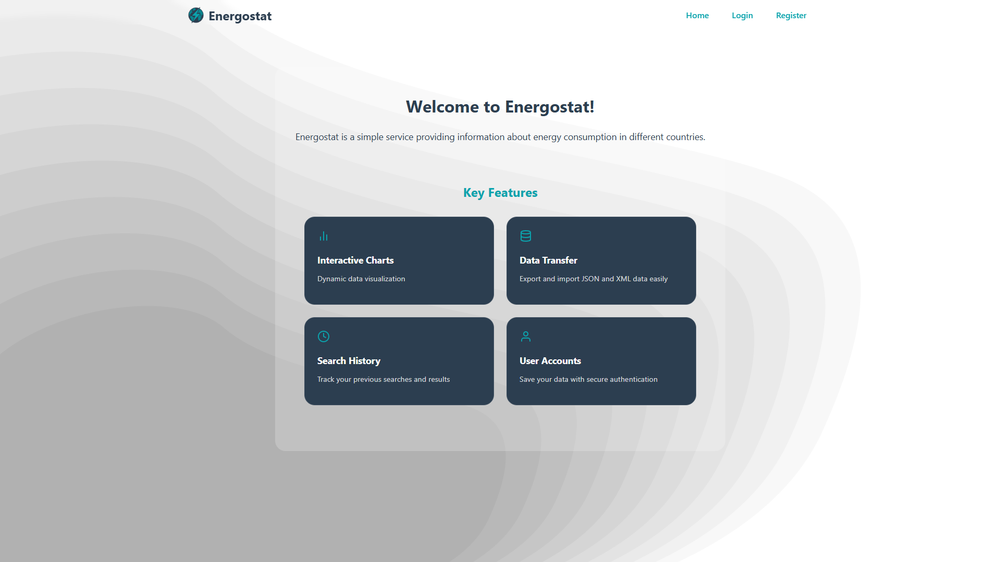
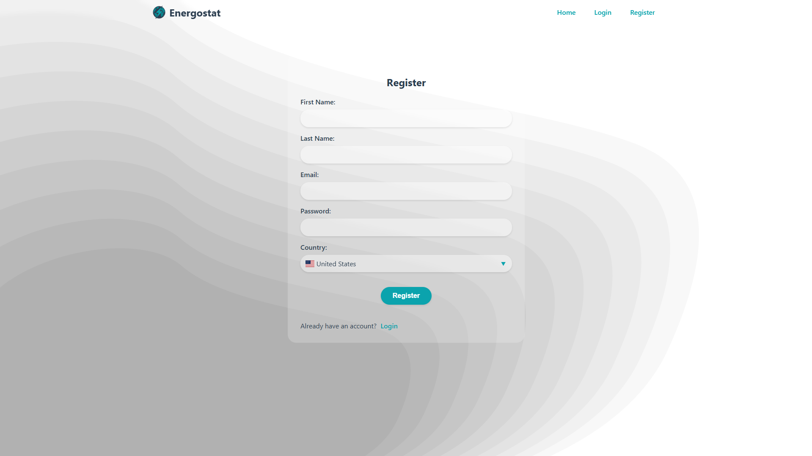
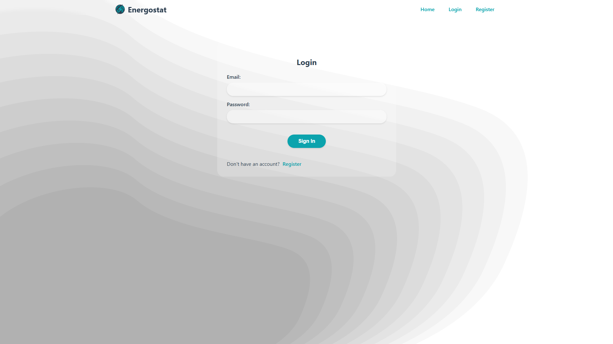
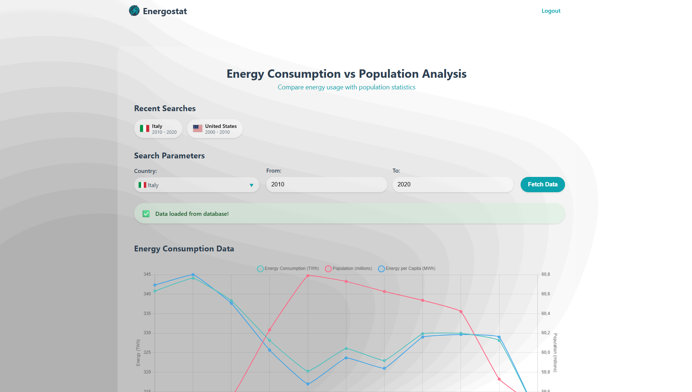
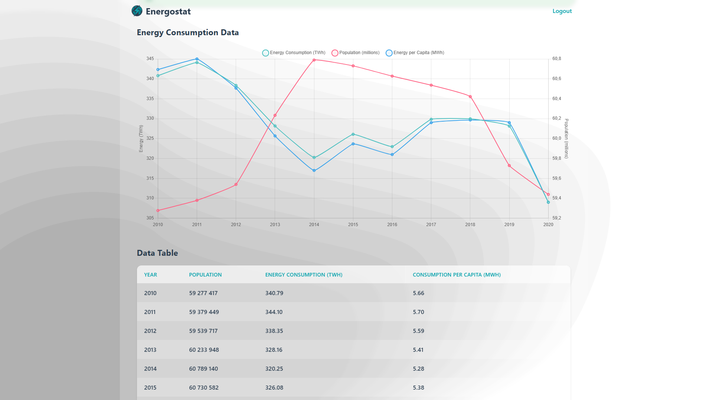
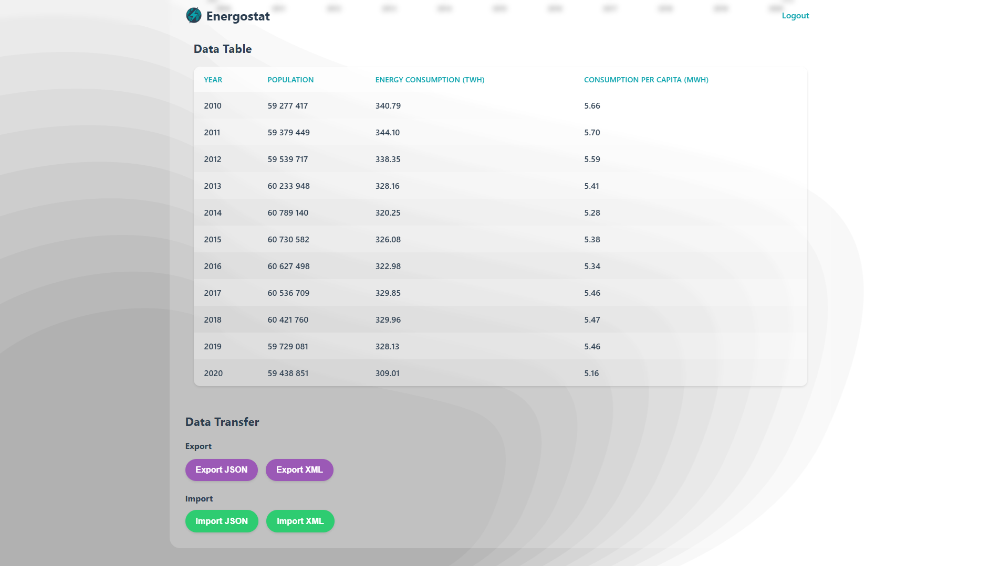


### Mobile Device
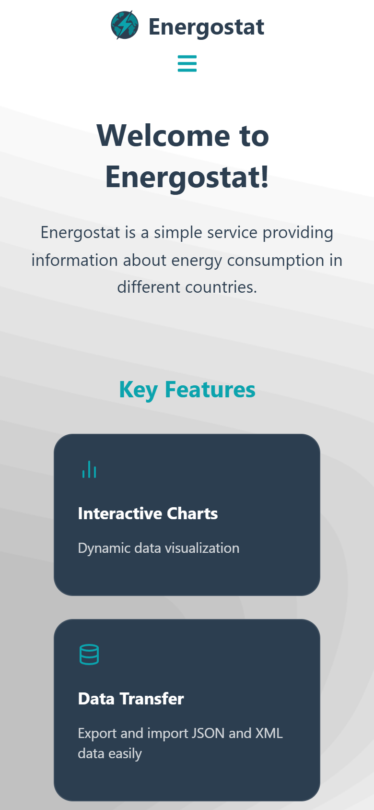 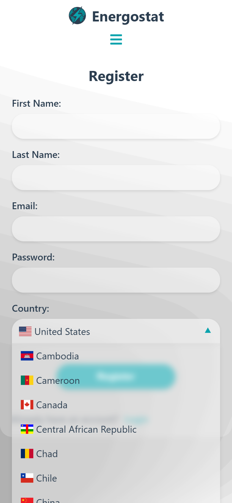
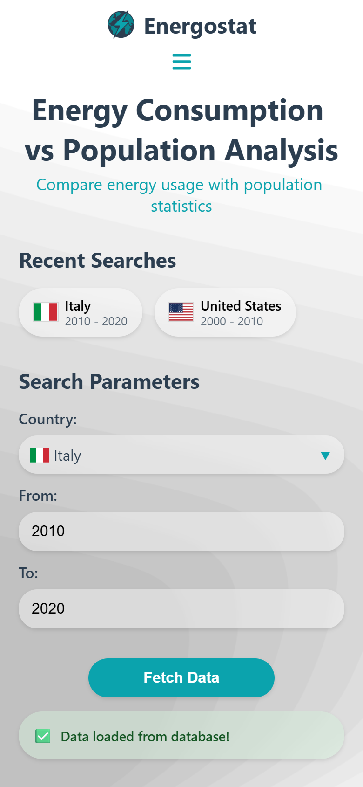 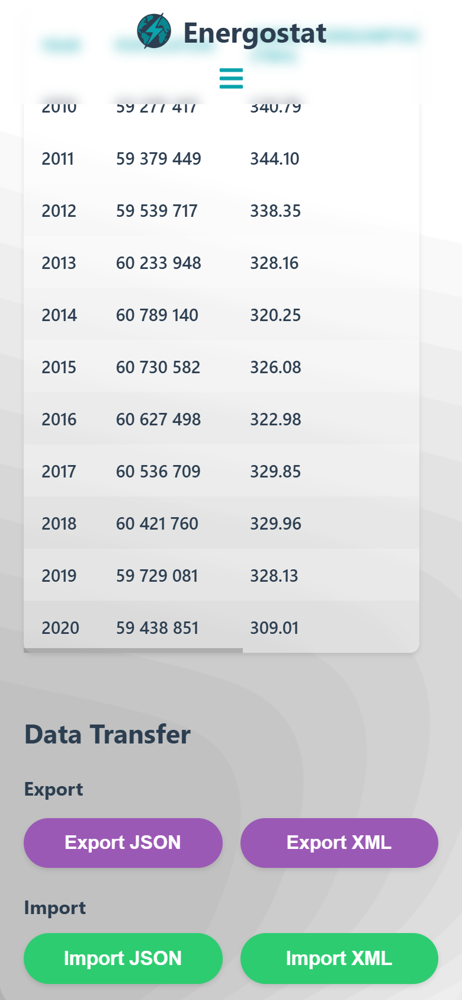
